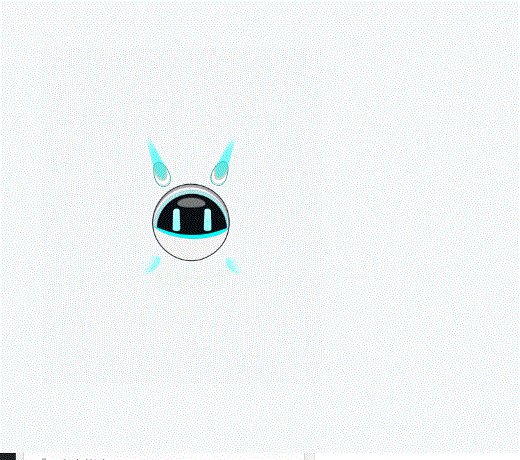

# SuperNoNo 使用说明

SuperNoNo 是一个 Windows 桌面宠物程序。启动后，它会以一个透明置顶的小桌宠形式显示在桌面上，可以点击、拖拽、播放动作，也可以通过托盘菜单控制行为。

## 适用环境

- Windows 10 / Windows 11
- 已安装 Microsoft Edge WebView2 Runtime
- 如果只使用发布版，不需要安装 .NET SDK 或 Node.js

## 如何启动

打开发布目录，双击运行：

```text
SuperNoNo.exe
```

如果你拿到的是完整 Release 文件夹，请保持文件夹结构不变。`SuperNoNo.exe` 需要同目录下的 `Live2DPlayer`、`VIP nono` 等资源文件，单独拷贝 exe 可能无法正常显示桌宠。

典型目录结构如下：

```text
SuperNoNo\
├─ SuperNoNo.exe
├─ Live2DPlayer\
├─ VIP nono\
├─ Microsoft.Web.WebView2.Core.dll
├─ Microsoft.Web.WebView2.WinForms.dll
└─ ...
```

## 效果预览

### Codex 思考 / 充电


### 点击互动


### 拖拽移动



## 基本操作

- 拖拽桌宠主体：移动桌宠位置。
- 单击桌宠主体：播放互动动作。
- 双击桌宠主体：播放更活跃的互动动作。
- 长按桌宠主体：播放特殊反应动作。
- 点击透明区域：不会拦截鼠标，会直接点到下方窗口。
- 右键系统托盘图标：打开功能菜单。

## 托盘菜单

SuperNoNo 启动后会在系统托盘显示图标。右键图标可以看到菜单：

- `鼠标穿透模式`：开启后，整个桌宠都不响应鼠标，适合临时避免遮挡操作。
- `随机动作`：立即播放一个随机动作。
- `自动随机动作`：空闲时自动播放动作。
- `视线跟随`：桌宠视线跟随鼠标位置。
- `桌面巡游`：桌宠空闲时会自动在桌面上轻微移动。
- `Codex 进度联动`：读取本地进度状态并展示对应动作。
- `动作`：手动选择开心、跳舞、充电、流汗等动作。
- `移动到左上角` / `移动到右下角`：快速移动位置。
- `退出`：关闭 SuperNoNo。

## Codex 进度联动

这是一个可选功能。开启后，SuperNoNo 会读取本机状态文件，并根据状态播放动作或显示气泡。

状态文件位置：

```text
%LOCALAPPDATA%\DesktopPet\codex-progress.json
```

示例内容：

```json
{
  "state": "coding",
  "progress": 40,
  "message": "正在修改代码",
  "updatedAt": "2026-06-17T05:30:00.0000000Z"
}
```

常用状态：

```text
thinking   思考中，进入充电动作
coding     编码中
building   构建中
testing    测试中
reviewing  检查中
success    完成，显示完成气泡
warning    完成但有提醒
error      失败
blocked    等待处理
idle       空闲
```

项目提供了一个写状态的辅助脚本，可用于手动测试：

```powershell
powershell -ExecutionPolicy Bypass -File tools\codex-pet-status.ps1 -State thinking -Progress 10 -Message "正在思考"
powershell -ExecutionPolicy Bypass -File tools\codex-pet-status.ps1 -State success -Progress 100 -Conclusion "任务完成"
```

如果你不是在项目根目录运行脚本，请把 `tools\codex-pet-status.ps1` 改成实际完整路径。

## 常见问题

### 双击 exe 后没有显示

请确认 `Live2DPlayer` 和 `VIP nono` 文件夹仍在 exe 同级目录下。如果这些资源缺失，桌宠无法加载模型。

### 桌宠挡住鼠标操作

右键托盘图标，开启 `鼠标穿透模式`。开启后鼠标会穿过桌宠，直接操作桌面或下方窗口。

### 透明边缘点不到下面窗口

当前版本默认只有桌宠主体可点击，透明宿主窗口区域会穿透。如果仍然遇到遮挡，先确认没有开启其他置顶窗口或旧版本程序。

### Codex 联动没有反应

请确认：

- 托盘菜单中的 `Codex 进度联动` 已勾选。
- `%LOCALAPPDATA%\DesktopPet\codex-progress.json` 文件存在并且刚刚更新。
- 状态文件里的 `state` 是支持的状态。
- 状态文件长时间未更新时，SuperNoNo 会自动回到空闲状态。

## 从源码构建

普通使用者可以跳过本节。需要从源码构建时，在项目根目录运行：

```powershell
dotnet build .\SuperNoNo.csproj -c Release
```

构建会自动生成 Live2D 前端并复制模型资源。构建成功后，运行：

```powershell
.\bin\Release\net9.0-windows\SuperNoNo.exe
```

如果构建时看到 WebView2 / WindowsBase 引用版本警告，但最终是 `0 个错误`，通常可以忽略。

## 文件说明

- `SuperNoNo.exe`：主程序。
- `Live2DPlayer`：桌宠显示所需的前端播放器。
- `VIP nono`：Live2D 模型、动作和音频素材。
- `Assets\SuperNoNo.ico`：应用图标。
- `tools\codex-pet-status.ps1`：可选的 Codex 状态写入脚本。
